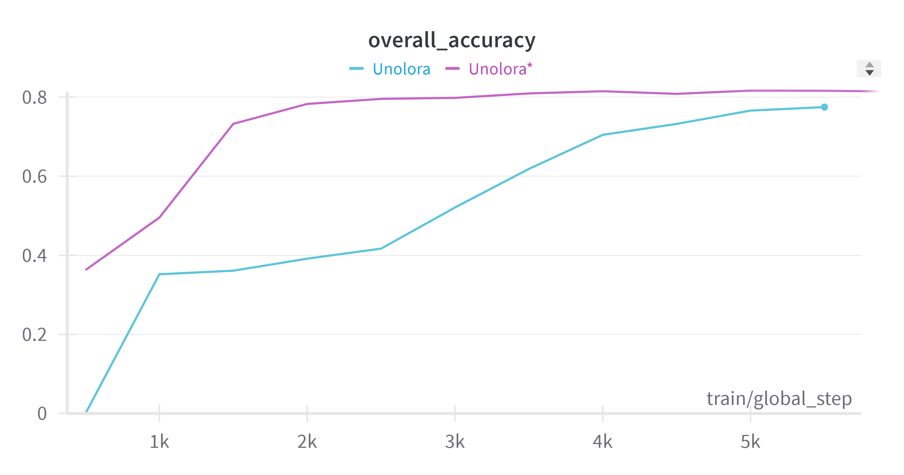
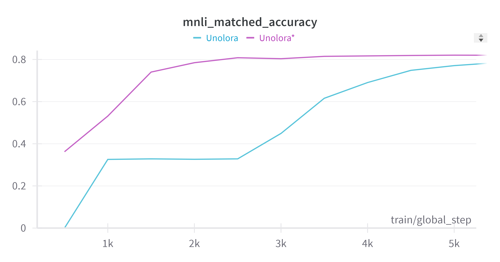

# UnoLoRA: Single Low-Rank Adaptation for Efficient Multitask Fine-tuning

**Akash Kamalesh ⋅ Anirudh Lakhotia ⋅ Nischal S ⋅ Prerana Sanjay Kulkarni ⋅ Gowri Srinivasa**

Accepted to the **NeurIPS 2024 Workshop on Fine-Tuning in Modern Machine Learning: Principles and Scalability (FITML)**. This repository contains the official code implementation of the paper.



## Overview

Standard multi-task LoRA setups either train one low-rank adapter per task (expensive to store and serve) or train a single shared adapter that struggles to specialize across heterogeneous tasks. **UnoLoRA** addresses this by using a **single shared pair of low-rank matrices** (`A`, `B`) across the entire model, and conditioning their contribution at each layer with a lightweight **shared hypernetwork**.

For every injected LoRA layer, the hypernetwork takes in:
- a **task embedding** (which GLUE task the batch belongs to),
- a **layer/position embedding** (which attention layer/projection the adapter sits in), and
- a **bottlenecked sample encoding** (a compressed representation of the input, derived from the mean-pooled token embeddings),

and produces a per-task, per-layer, per-sample **rank-wise scaling vector**. This vector rescales the intermediate LoRA activation (`x @ A`) before it is projected back up by `B`, so a single low-rank update can be modulated differently for each task and each layer without adding a separate adapter per task:

```
h = W₀x + (α / r) · B · ((x @ A) ⊙ task_scale(task, layer, sample))
```

This keeps the number of trainable parameters close to that of a single LoRA adapter, while the hypernetwork gives it the expressiveness needed to handle multiple GLUE tasks jointly.

UnoLoRA is implemented on top of **T5-base** and injects adapters into the query (`q`) and value (`v`) projections of every self-attention block in the encoder, the self-attention blocks in the decoder, and the encoder-decoder cross-attention blocks in the decoder.



## Repository Structure

```
.
├── unolora.py                       # Core UnoLoRA implementation (hypernetwork + shared low-rank adapters) and training loop
├── shared_lora_run.py               # Baseline: a single shared PEFT LoRA adapter trained jointly across all tasks
├── analysis_utilities.py            # Utilities for extracting/analyzing LoRA matrices, importance, and rank statistics
├── t5-cola.py                       # Single-task T5 + LoRA fine-tuning on CoLA
├── t5-mnli.py                       # Single-task T5 + LoRA fine-tuning on MNLI
├── t5-mrpc.py                       # Single-task T5 + LoRA fine-tuning on MRPC
├── t5-qnli.py                       # Single-task T5 + LoRA fine-tuning on QNLI
├── t5-qqp.py                        # Single-task T5 + LoRA fine-tuning on QQP
├── t5-rte.py                        # Single-task T5 + LoRA fine-tuning on RTE
├── t5-sst2.py                       # Single-task T5 + LoRA fine-tuning on SST-2
├── t5-stsb.py                       # Single-task T5 + LoRA fine-tuning on STS-B
├── environment.sh                   # Conda/pip environment setup script
├── *.png                            # W&B result plots (accuracy/Pearson comparisons across variants)
└── README.md
```

Each single-task script (`t5-*.py`) follows the same pattern: task-specific preprocessing of the GLUE dataset into a text-to-text format, dataset/dataloader preparation, LoRA-wrapped T5 initialization, and a training + evaluation loop logged to Weights & Biases. `unolora.py` builds on this pipeline but combines **all GLUE tasks** into a single multi-task run using a temperature-sampled batch sampler, and replaces standard LoRA layers with the shared, hypernetwork-conditioned `Unolora` adapters described above.

## Environment Setup

1. Make sure you have Python 3.8+ available.
2. Run the setup script to install Miniconda and create the `unolora` conda environment with all required packages:
   ```
   bash environment.sh
   ```
3. Before running any script, update the `wandb.init()` call in that script with your own W&B `project` and `entity` names.

## Running Experiments

Activate the environment and log in to Weights & Biases first:

```
conda activate unolora
wandb login
```

**Single-task baselines** — fine-tune T5 with a per-task LoRA adapter:

```
python t5-mnli.py
python t5-mrpc.py
python t5-qnli.py
python t5-qqp.py
python t5-rte.py
python t5-sst2.py
python t5-stsb.py
python t5-cola.py
```

**Shared LoRA baseline** — a single standard LoRA adapter trained jointly across all GLUE tasks:

```
python shared_lora_run.py
```

**UnoLoRA (main method)** — single shared low-rank adapter with the hypernetwork-based task/layer conditioning, trained jointly across all GLUE tasks:

```
python unolora.py
```

Before launching a run, review the hyperparameters at the top of the script (batch size, learning rate, LoRA `rank`/`alpha`, task/sample embedding dimensions, hypernetwork bottleneck dimension, etc.) and adjust them for your hardware and target tasks.

## Monitoring and Logging

All experiments are logged to Weights & Biases:

1. Go to your [W&B dashboard](https://wandb.ai).
2. Select your project.
3. Open the relevant run to inspect loss curves, per-task accuracy/F1/Matthews correlation/Pearson correlation, and sampled task distributions over training.

## Notes

- All scripts use a fixed random seed (42) for reproducibility.
- Training uses GLUE benchmark tasks (CoLA, MNLI, MRPC, QNLI, QQP, RTE, SST-2, STS-B) reformulated as text-to-text problems for T5.
- Adjust `batch_size`, `learning_rate`, LoRA `rank`/`alpha`, and hypernetwork dimensions to fit your GPU memory and target tasks.

## Citation

If you find this work useful, please cite:

```bibtex
@inproceedings{kamalesh2024unolora,
  title={UnoLoRA: Single Low-Rank Adaptation for Efficient Multitask Fine-tuning},
  author={Kamalesh, Akash and Lakhotia, Anirudh and Kulkarni, Prerana Sanjay and Srinivasa, Gowri and others},
  booktitle={NeurIPS 2024 Workshop on Fine-Tuning in Modern Machine Learning: Principles and Scalability}
}
```